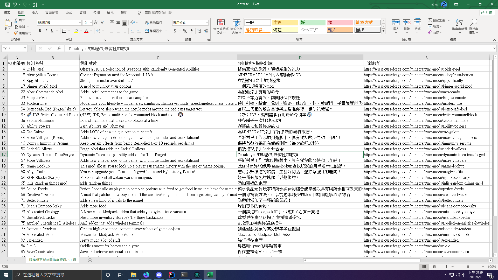

## GetLatestMods CurseForge模組列表器

### 介紹
這個程式可以讓你抓取指定時間內的CurseForge模組並且做成試算表格式(如下圖)  



### 下載
如需自行建置可參考下方的建置教學，如果不想自行建置可直接下載已經建置好的檔案  
Windows: [點我下載](https://github.com/SiongSng/GetLatestMods/raw/main/Build/Windows/GetLatestMods.exe)  
Linux: (請自行建置)  
MacOS: (請自行建置)

### 組態
請在執行目錄底下新建 **config.json** 此檔案，並輸入以下內容，用來儲存設定。
```json
{
  "GameVersion" : "1.16.5",
  "PageSize": "100",
  "Date": "2021-05-01T00:00:00.00Z>2021-06-01T00:00:00.00Z"
}
```
GameVersion: Minecraft模組的版本號(如 1.16/1.12/1.17.1...)。  
PageSize: 要檢索的模組數量。  
Date: 檢索的時間範圍。
### 建置
請先安裝 [Node.js](https://nodejs.org/en/) 再執行以下操作。  
提醒您:在不同平台建置時，請使用該平台的設備才能正常建置。
```cmd
npm install
```
Windows:
```cmd
pkg package.json -t win
```
Linux:
```cmd
pkg package.json -t linux
```
MacOS:
```cmd
pkg package.json -t mac
```

### 授權
本著作係採用 [MIT](https://opensource.org/licenses/MIT) 授權條款授權。


